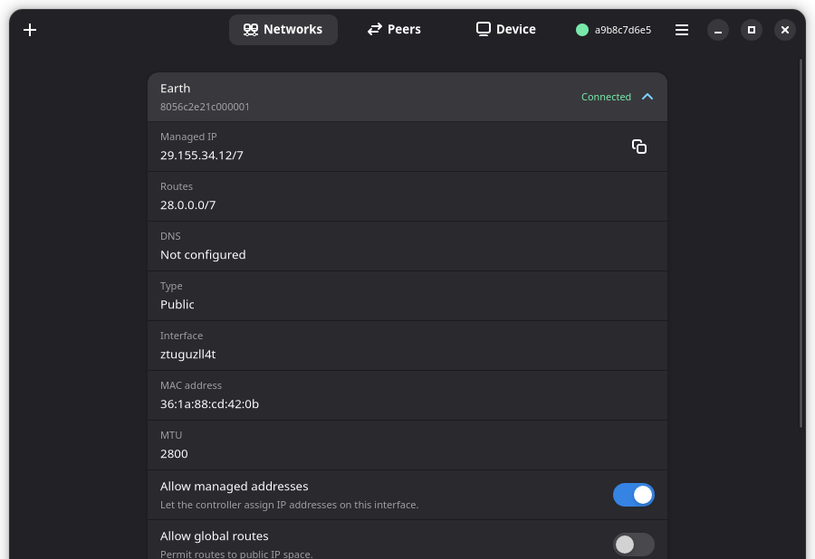

# ZTDeck

A small, unofficial desktop client for the [ZeroTier](https://www.zerotier.com/)
One service, built with GTK4 and libadwaita.

ZTDeck does not replace the ZeroTier daemon — it talks to the one already
running on your machine through its local control API, and gives you a clear
view of your networks and peers without dropping to the command line.



## Features

- Node address, version and online state at a glance
- Join and leave networks, with network ID validation before anything is sent
- See the routes and DNS settings a controller publishes — the first thing to
  check when a network is up but traffic is not going where you expect
- Per-network toggles: managed addresses, global routes, default route, DNS
- Peer list with role, link type (direct or relayed) and latency
- A Device page with the node identity, version and transport, so you can hand
  an administrator what they need to authorize you
- A warning when traffic falls back to TCP relaying, which is markedly slower
  than a direct UDP connection
- Desktop notifications when a network connects or stops responding
- Copy buttons for the addresses and identifiers you actually need to paste
  elsewhere
- Adaptive layout: view switcher in the header on wide windows, a bottom bar on
  narrow ones
- Polls every 3 seconds while focused and backs off to 30 seconds once you
  switch away, so it does not drain a laptop in the background

## Requirements

- The ZeroTier One service, installed and running on the host:
  ```bash
  curl -s https://install.zerotier.com | sudo bash
  sudo systemctl enable --now zerotier-one
  ```
- GTK 4.14+ and libadwaita 1.5+ (already provided by the Flatpak runtime)

## Granting access to the service token

The ZeroTier daemon protects its control API with a token stored at
`/var/lib/zerotier-one/authtoken.secret`, readable only by root. ZTDeck runs as
your normal user (and, as a Flatpak, inside a sandbox), so it needs a copy it can
actually read. This is the same procedure documented in the `zerotier-cli(1)`
manual page:

```bash
sudo cp /var/lib/zerotier-one/authtoken.secret ~/.zeroTierOneAuthToken
sudo chown $USER ~/.zeroTierOneAuthToken
chmod 600 ~/.zeroTierOneAuthToken
```

ZTDeck shows this command on its first-run screen with a copy button, and picks
the token up automatically once it exists. You can also paste the token into the
setup screen instead; it is then stored in ZTDeck's own configuration directory
with owner-only permissions.

> **Note on security:** anyone who can read this token can join or leave
> networks on this machine. Keep the copy private, and remove it
> (`rm ~/.zeroTierOneAuthToken`) if you stop using ZTDeck.

ZTDeck looks for the token in this order:

1. `$ZTDECK_TOKEN_FILE`, if set (used by the test suite)
2. `$XDG_CONFIG_HOME/ztdeck/authtoken.secret` — written by the setup screen
3. `~/.zeroTierOneAuthToken` — the location `zerotier-cli` uses
4. `/var/lib/zerotier-one/authtoken.secret` — only readable when run as root

## Installing

### Flatpak (recommended)

```bash
flatpak install flathub io.github.ygtadk.ZTDeck
```

### Building from source

```bash
git clone https://github.com/ygtadk/ztdeck.git
cd ztdeck
flatpak install org.gnome.Platform//51 org.gnome.Sdk//51 org.flatpak.Builder
flatpak run org.flatpak.Builder --user --install --force-clean \
    build build-aux/flatpak/io.github.ygtadk.ZTDeck.yml
flatpak run io.github.ygtadk.ZTDeck
```

Or with Meson directly, if you have the GTK4 and libadwaita development
packages plus PyGObject installed system-wide:

```bash
meson setup builddir --prefix=/usr/local
meson compile -C builddir
sudo meson install -C builddir
ztdeck
```

## Translating

ZTDeck is fully translatable. Translations live in `po/`; Turkish ships with
the app.

To add a language, add its code to `po/LINGUAS`, then:

```bash
meson setup builddir
ninja -C builddir ztdeck-pot          # refresh the template
msginit --input=po/ztdeck.pot --locale=de --output=po/de.po
# translate po/de.po, then check it
msgfmt --check --statistics -o /dev/null po/de.po
ninja -C builddir                     # build the catalogues
```

To test a translation without changing your session language:

```bash
flatpak run --env=LANGUAGE=de --env=LC_ALL=de_DE.UTF-8 io.github.ygtadk.ZTDeck
```

> Catalogues are loaded from the directory the Meson launcher passes in
> `ZTDECK_LOCALE_DIR`. Python's `gettext` otherwise defaults to
> `sys.prefix/share/locale`, which inside a Flatpak is `/usr/share/locale` and
> never contains ZTDeck's catalogues — the app would silently run in English.

## Development

The repository ships a mock ZeroTier API so the UI can be developed and tested
without touching the real service, or even having it installed:

```bash
# Terminal 1 — fake daemon on port 19993
python3 tests/mock_daemon.py

# Terminal 2 — the test suite (needs a display; broadway works headlessly)
GDK_BACKEND=broadway ZTDECK_PORT=19993 \
    ZTDECK_TOKEN_FILE=/tmp/ztdeck-mock-token \
    python3 tests/test_ztdeck.py
```

The suite covers the API client (including auth failure, an unreachable daemon
and a missing token), route and DNS formatting, the network and peer list
reconciliation, the Device page, notification de-duplication, the join dialog's
validation, and the gettext wiring.

Point `ZTDECK_TEST_CATALOGUE` at a built locale directory to additionally
verify that translations really load:

```bash
ZTDECK_TEST_CATALOGUE=builddir/po python3 tests/test_ztdeck.py
```

To run the app itself against the mock:

```bash
ZTDECK_PORT=19993 ZTDECK_TOKEN_FILE=/tmp/ztdeck-mock-token \
    python3 -c "import sys; sys.path.insert(0, 'src'); \
        from ztdeck import main; main.run('0.1.0', 'io.github.ygtadk.ZTDeck')"
```

### Environment variables

| Variable | Purpose |
|---|---|
| `ZTDECK_PORT` | Control API port (default `9993`) |
| `ZTDECK_TOKEN_FILE` | Token file to use before the normal search paths |
| `ZTDECK_LOCALE_DIR` | Where to load translation catalogues from |

### Project layout

```
src/              application code
  client.py       ZeroTier local API client
  window.py       main window, polling and actions
  networks.py     networks page and join dialog
  peers.py        peers page
  device.py       node identity and connection health
  notifications.py  network state change notifications
  setup_view.py   first-run token setup
  i18n.py         translation helpers
data/             desktop entry, AppStream metainfo, icons, screenshots
po/               translation catalogues
build-aux/        Flatpak manifests (local build and Flathub submission)
tests/            mock daemon and functional tests
```

## Troubleshooting

**"ZeroTier service is not running"** — nothing is listening on the control
port. Check with `systemctl status zerotier-one`.

**"Authentication token was rejected"** — your copy of the token is stale. The
daemon regenerates it if its working directory is reset; copy it again.

**A network sits at "Requesting configuration"** — the controller has not
authorized this device yet. Approve it in ZeroTier Central, or ask the network's
administrator to. The Device page has the node address to give them.

**The Device page shows "TCP relay (slow fallback)"** — UDP could not get
through, usually a restrictive firewall, and traffic is being tunnelled over
TCP. Connectivity works but throughput and latency suffer.

**Clicking the app icon does nothing** — an earlier instance is still running
and owns the application's D-Bus name, so the new launch just asks the old
window to present itself. Clear it with
`flatpak kill io.github.ygtadk.ZTDeck`.

## License

MIT — see [LICENSE](LICENSE).

## Disclaimer

ZTDeck is an unofficial, community-built client. It is not affiliated with,
endorsed by, or sponsored by ZeroTier, Inc. "ZeroTier" is a trademark of
ZeroTier, Inc.
